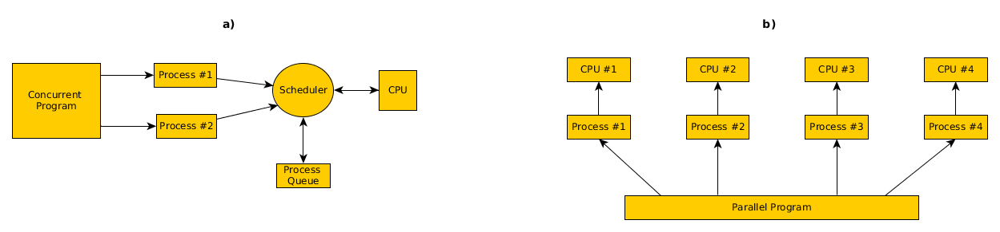
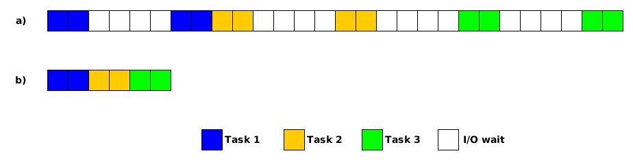

# [Chosen aspects of concurrency in Python](http://blog.idego.pl/2015/11/12/threading-and-multiprocessing-in-python-3/)

<!-- toc orderedList:0 -->

- [Chosen aspects of concurrency in Python](#chosen-aspects-of-concurrency-in-pythonhttpblogidegopl20151112threading-and-multiprocessing-in-python-3)
	- [Resources](#resources)
	- [Introduction](#introduction)
	- [Threads and processes](#threads-and-processes)
	- [`threading` and `multiprocesing` with Python](#threading-and-multiprocesing-with-python)
		- [Python GIL](#python-gil)
			- [Thread Execution Model](#thread-execution-model)
			- [An Experiment](#an-experiment)
		- [`_thread` module](#_thread-modulehttpsdocspythonorg3library_threadhtml)
		- [`threading` module](#threading-modulehttpsdocspythonorg3librarythreadinghtml)
		- [`queue` module](#queue-modulehttpsdocspythonorg3libraryqueuehtml)
		- [`multiprocessing` module](#multiprocessing-module)

<!-- tocstop -->

 ## Resources

[Chosen aspects of concurrency in Python 3](http://blog.idego.pl/2015/11/12/threading-and-multiprocessing-in-python-3/)

[Understanding the Python GIL (Global Interpreter Lock) by David Beazley](http://dabeaz.com/python/UnderstandingGIL.pdf)

## Introduction



## Threads and processes

**Processes**: programs in execution. Has its own address space, memory, data stack, tracking/auxiliary data.

**Threads**: similar to process except that they all execute within the same process, so share the same context.

- has a beginning, an execution sequence, and a conclusion.
- has an instruction pointer that keeps track of where within its context it is currently running (state).
- can be preempted (interrupted)
- can be temporarily put on hold (sleeping) while other threads are running -- yielding.
- can share information or communicate with one another more easily than processes.

> I/O (Input/Output) operations (such as reading from memory, disk, or the network) can be quite burdensome to the flow of a program. Every time code reads from a file or writes to a network socket, it must pause to contact the kernel, request that the operation happen, and then wait for it to complete. Most of the performed I/O operations are orders of magnitudqe slower than CPU operations. Execution of programs is paused to complete these operations, time spent in paused state is called "I/O wait".



## `threading` and `multiprocesing` with Python

### Python GIL

- Control access to the Python Virtual Machine
- ensures that exactly one thread is running. Parallel execution is forbidden
- Simplifies many low-level details (memory management, callouts to C extensions, etc.)
- can be completely avoided by using processes instead of threads.

Read more:

- [Understanding the Python GIL (Global Interpreter Lock) by David Beazley](http://dabeaz.com/python/UnderstandingGIL.pdf)
- [Interactive Python Thread Visualization by David Beazley](http://www.dabeaz.com/GIL/gilvis/index.html)

#### Thread Execution Model

- When a thread is running, it holds the GIL
- GIL released on I/O (read,write,send,recv,etc.)
- CPU-bound threads that never perform I/O are handled as a special case
- A "check" occurs every 100 "ticks"
- Change it using `sys.setcheckinterval()`

#### An Experiment

Consider this trivial CPU-bound function:

```python
def countdown(n):
    while n > 0:
        n -= 1
# Run it once with a lot of work
COUNT = 100000000  # 100 million
countdown(COUNT)
# Now, subdivide the work across two threads
t1 = Thread(target=countdown,args=(COUNT//2,))
t2 = Thread(target=countdown,args=(COUNT//2,))
t1.start(); t2.start()
t1.join(); t2.join()
```

1. Performance on a Intel Core i3:

  - Sequential: 9.16s
  - Threaded (2 threads) : 9.5s

2. Performance if work divided across 4 threads

  - Threaded (4 threads) : 10.7s

### [`_thread` module](https://docs.python.org/3/library/_thread.html)

- provides low-level primitives for working with multiple threads
- For synchronization, simple locks (mutexes or binary semaphores) are provided.
- recommended only for experts desiring lower level thread access

```python
import _thread  
from time import sleep, ctime

def loop1():  
    print('Start loop 1 at:', ctime())
    sleep(4)
    print('Loop 1 done at:', ctime())

def loop2():  
    print('Start loop 2 at:', ctime())
    sleep(2)
    print('Loop 2 done at:', ctime())

def main():  
    print('Starting at:', ctime())
    _thread.start_new_thread(loop1, ())
    _thread.start_new_thread(loop2, ())
    sleep(6)
    # without this line above it would proceed immediately to the next statement
    print('All tasks done at:', ctime())

if __name__ == '__main__':  
    main()
```

### [`threading` module](https://docs.python.org/3/library/threading.html)

- construct higher-level threading interfaces on top of the lower level `_thread` module.
- if `_thread` is missing, use `dummy_threading` instead of `threading`

### [`queue` module](https://docs.python.org/3/library/queue.html)

- implements multi-producer, multi-consumer queues
- Three types of queue: FIFO, LIFO, priority queue.
- Can be used when multiple threads need to safely communicate or exchange data between them.
- Queue instances already have all of the required locking,
- so they can be safely shared by as many threads as you wish

```python
from queue import Queue
from threading import Thread

# A thread that produces data
def producer(out_queue):  
    while True:
    # Produce some data
    # ...
    out_queue.put(data)

# A thread that consumes data
def consumer(in_queue):  
    while True:
    # Get some data
    data = in_queue.get()
    # Process the data
    # ...

# Create the shared queue and launch both threads
q = Queue()
t1 = Thread(target=consumer, args=(q,))
t2 = Thread(target=producer, args=(q,))
t1.start()
t2.start()
```

### `multiprocessing` module

- support processes
- using an API similar to the `threading` module,
- offers both local and remote concurrency, effectively side-stepping the GIL by using subprocesses instead of threads.
- Can use process-based and thread based parallel processing, share work over queues, share data among processes.
- mostly focused on single-machine multi-core parallelism.
