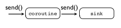
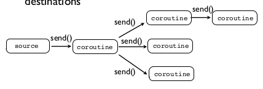

# Python Advanced: Coroutines

<!-- toc orderedList:0 -->

- [Python Advanced: Coroutines](#python-advanced-coroutines)
	- [Resources](#resources)
	- [Coroutines ?](#coroutines)
	- [Coroutines](#coroutines-1)
	- [Coroutines vs. Generators](#coroutines-vs-generators)
	- [Coroutines, Pipelines, and Dataflow](#coroutines-pipelines-and-dataflow)
		- [Pipeline Sources](#pipeline-sources)
		- [Pipeline Sinks](#pipeline-sinks)
		- [Pipeline Filters](#pipeline-filters)
		- [Being Branchy](#being-branchy)
	- [Coroutines vs. Objects](#coroutines-vs-objects)
	- [Coroutines and Event Dispatching](#coroutines-and-event-dispatching)
	- [Examples](#examples)

<!-- tocstop -->

 ## Resources

Coroutines module in Mark Summerfield's book: Programming in Python 3 - A Complete Introduction.

[A Curious Course on Coroutines and Concurrency](http://dabeaz.com/coroutines/) by David Beazley

## Coroutines ?

> Coroutines are functions whose processing can be suspended and resumed at specific points.

> a coroutine will execute up to a certain statement, then suspend execution while waiting for some data. At this point other parts of the program can continue to execute ... Once the data is received the coroutine resumes from the point it was suspended, performs processing (presumably based on the data it got), and possibly sending its results to another coroutine.

> Coroutines can have multiple entry and exit points, since they can have than one place where they suspend and resume.

Run, suspend, wait for data, resume with data it got, ... end.

Useful when:

- One data, multiple functions.
- Create data processing pipelines.
- Master and assistant functions.
- Alternatives to threading (simpler and lower-overhead)

May produce performance benefits, but require different way of thinking about processing.

## Coroutines

> a function that takes its input from a `yield` expression--normally inside an infinite loop (`While True:`)

```python
def grep(pattern):
    print "Looking for %s" % pattern
    while True:
        line = (yield)
        if pattern in line:
            print(line)

g = grep("python")
g.next()  # Prime it (explained shortly)
#Looking for python
g.send("Yeah, but no, but yeah, but no")
g.send("A series of tubes")
g.send("python generators rock!")
#python generators rock!

# Remembering to call .next() is easy to forget.
# Solved by wrapping coroutines with a decorator
def coroutine(func):
    def start(*args,**kwargs):
        cr = func(*args,**kwargs)
        cr.next()
        return cr
    return start

@coroutine
def grep(pattern):
    pass

# A coroutine might run indefinitely. Use `.close()` to shut it down
g.close()

# `close()` can be caught (GeneratorExit)
@coroutine
def grep(pattern):
    print "Looking for %s" % pattern
    try:
        while True:
            line = (yield)
            if pattern in line:
                print(line)
    except GeneratorExit:
        print("Going away. Goodbye")

# Exceptions can be thrown inside a coroutine
g = grep("python")
g.throw(RuntimeError,"You're hosed")
'''Traceback (most recent call last):
File "<stdin>", line 1, in <module>
File "<stdin>", line 4, in grep
RuntimeError: You're hosed'''
```

## Coroutines vs. Generators

Generators produce data for iteration, Coroutines are consumers of data

**Key difference**: Generators pull data through the pipe with iteration. Coroutines push data into the pipeline with `send()`.


## Coroutines, Pipelines, and Dataflow

Coroutines can be use to set up pipeline.

You just chain coroutines together and push data through the pipe with `send()` operations.


### Pipeline Sources

The pipeline needs an initial source (a producer). The source drives the entire pipeline. It is typically **not** a coroutine.


```python
def source(target):
    while not done:
        item = produce_an_item()
        ...
        target.send(item)
        ...
    target.close()
```

### Pipeline Sinks

The pipeline must have an end-point (sink).



```python
@coroutine
def sink():
    try:
        while True:
            item = (yield)  # Receive an item
            ...
    except GeneratorExit  # Handle .close()
        # Done
            ...
```

### Pipeline Filters

Intermediate stages both receive and send.


### Being Branchy

With coroutines, we can send data to multiple destinations.



```python
@coroutine
def broadcast(targets):
    while True:
        item = (yield)
        for target in targets:
            target.send(item)


f = open("access-log")
follow(f, broadcast([grep('python',printer()),
                    grep('ply',printer()),
                    grep('swig',printer())]))
```

> Coroutines provide more powerful data routing possibilities than simple iterators

> If you built a collection of simple data processing components, you can glue them together into complex arrangements of pipes, branches, merging, etc.

## Coroutines vs. Objects

```python
# GrepHandler class
class GrepHandler(object):
    def __init__(self,pattern, target):
        self.pattern = pattern
        self.target = target

    def send(self,line):
        if self.pattern in line:
            self.target.send(line)

# The coroutine version
@coroutine
def grep(pattern,target):
    while True:
        line = (yield)
        if pattern in line:  # 'self' free -> faster
            target.send(line)
```

## Coroutines and Event Dispatching

## Examples

see [py-coroutines_examples.py](/py-advanced/py-coroutines_examples.py)
