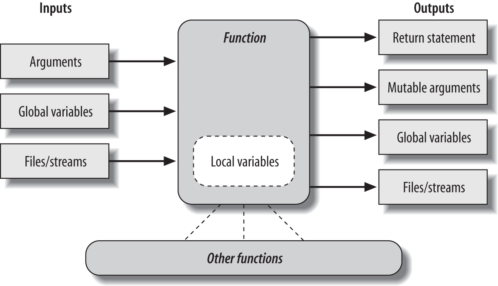

# Advanced Function Topics 

<!-- toc orderedList:0 -->

 - [Advanced Function Topics](#advanced-function-topics)

  - [Resources](#resources)
  - [Function Design Concepts](#function-design-concepts)

    - [Few general guidelines](#few-general-guidelines)

  - [Recursive Functions](#recursive-functions)
  - [Indirect Calls](#indirect-calls)
  - [Function Introspection and Attributes](#function-introspection-and-attributes)
  - [`lambda`](#lambda)

    - [How (Not) to Obfuscate Your Python Code](#how-not-to-obfuscate-your-python-code)
    - [Nested `lambda`s](#nested-lambdas)

  - [Functional Tools](#functional-tools)

<!-- tocstop -->

 ## Resources

Learning Python by Mark Lutz

## Function Design Concepts

- how to decompose a task into purposeful functions (_cohesion_)
- how your functions should communicate (_coupling_)
- the size of your functions
- ...

### Few general guidelines

- **Coupling: use arguments for inputs and return for outputs**. independent (of things outside) functions.
- **Coupling: use global variables only when truly necessary**. They can create dependencies & timing issues.
- **Coupling: don't change mutable arguments unless the caller expect it**. Write pure functional functions.
- **Cohesion: each function should have a single, unified purpose**. A function should do one thing--sth you can summarize in a simple declarative sentence.
- **Size: each function should be relatively small**.
- **Coupling: avoid changing variables in another module file directly**.

The more self-contained a function is, the easier it will be to understand, reuse, and modify.



## Recursive Functions

- relatively rare to see in Python
- large stack space

## Indirect Calls

```python
def echo(message):
    print(message)

echo('Direct call')

x = echo
x('Indirect call')

def indirect(func, arg):
    func(arg)

indirect(echo, 'Callback')
```

## Function Introspection and Attributes

```python
dir(func)
# ['__annotations__', '__call__', '__class__', '__closure__', '__code__', '__defaults__', '__delattr__', '__dict__', '__dir__', '__doc__', '__eq__', '__format__', '__ge__', '__get__', '__getattribute__', '__globals__', '__gt__', '__hash__', '__init__', '__kwdefaults__', '__le__', '__lt__', '__module__', '__name__', '__ne__', '__new__', '__qualname__', '__reduce__', '__reduce_ex__', '__repr__', '__setattr__', '__sizeof__', '__str__', '__subclasshook__']

func.count = 0
func.count += 1
dir(func)
# [..., 'count', ...]
```

## `lambda`

- `lambda`: an expression, not a statement.
- `lambda` body: a single expression, not a block of statements.
- Frequently use in writing callback handlers

### How (Not) to Obfuscate Your Python Code

```python
lower = (lambda x, y: x if x < y else y)

# embed `map` calls or comprehensions if you need to perform loops within a lambda
showall = lambda x: [print(line, end='') for line in x]
showall = lambda x: print(*x, sep='\n', end='')
```

### Nested `lambda`s

```python
action = (lambda x: (lambda y: x - y))
act = action(99)
act(2)  # 97
((lambda x: (lambda y: x - y))(99))(4)  #95
```

- Work but seems fairly convoluted code
- generally best avoided

## Functional Tools

`map` calls can be twice as fast as equivalent `for` loops, and list comprehensions are often faster than `map` calls.

`map` and list comprehensions run at C language speed inside the interpreter, which is often much faster than stepping through Python `for` loop bytecode within the PVM.

generator expressions often are equivalent to 3.X `map` and `filter` calls, because both generate result items on request.
