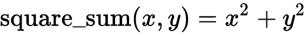
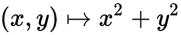
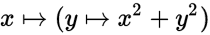

# Functional Programming Concepts

<!-- toc orderedList:0 -->

 - [Functional Programming Concepts](#functional-programming-concepts)

  - [Resources](#resources)
  - [Lambda Calculus](#lambda-calculus)
  - [Techniques](#techniques)

    - [Currying](#curryinghttpswikiwandcomencurrying)

      - [Currying vs. Partial](#currying-vs-partial)

    - [Composing Function](#composing-function)

<!-- tocstop -->

 ## Resources

- [Lambda Calculus](https://www.wikiwand.com/en/Lambda_calculus) via Wikipedia
- [Functional Prorgraming](https://wikiwand.com/en/Functional_programming) via Wikipedia
- Higher order function

  - [Filter](https://wikiwand.com/en/Filter_(higher-order_function)) via Wikipedia
  - [Fold](https://wikiwand.com/en/Fold_(higher-order_function)) via Wikipedia
  - [Map](https://wikiwand.com/en/Map_(higher-order_function)) via Wikipedia

- Techniques:

  - [Currying](https://wikiwand.com/en/Currying) via Wikipedia and [StackExchange topic](https://programmers.stackexchange.com/questions/185585/what-is-the-advantage-of-currying)
  - [Partial application](https://wikiwand.com/en/Partial_application) via Wikipedia
  - Pipeline
  - [Function Composition](https://www.wikiwand.com/en/Function_composition_(computer_science))
  - [Recursion](https://www.wikiwand.com/en/Recursion_(computer_science)) via Wikipedia
  - [Lookup Table](https://www.wikiwand.com/en/Lookup_table) via Wikipedia
  - [Memoization](https://www.wikiwand.com/en/Memoization) via Wikipedia

## Lambda Calculus



can be rewritten as:



and



## Techniques

### [Currying](https://wikiwand.com/en/Currying)

> Given a function `f` of type `f:(X * Y) -> Z`, currying it makes a function `curry(f): X -> (Y -> Z)`. `curry(f)` takes an argument of type `X` and returns a function of type `Y -> Z`.

#### Currying vs. Partial

> _partial function application_ refers to the process of fixing a number of arguments to a function, producing another function of smaller arity. with `f:(X * Y * Z) -> N` we might fix (or 'bind') the 1st argument,producing a function type `partial(f): (Y * Z) -> N`

> Intuitively, partial function application says "if you fix the first arguments of the function, you get a function of the remaining arguments".

> Partial application can bee seen as evaluating a curried function at a fixed point.

```python
from functools import partial

def power(base, exponent):
    return base ** exponent

square = partial(power, exponent=2)
cube = partial(power, exponent=3)

def test_partials():
    assert square(2) == 4
    assert cube(2) == 8
```

### Composing Function

```python
from functools import reduce

def compose(*funcs):
    '''Compose a group of functions (f(g(h(...)))) into a single composite func.'''
    return reduce(lambda f, g: lambda *args, **kwargs: f(g(*args, **kwargs)), funcs)

# Example
f = lambda x: x+1
g = lambda x: x*2
h = lambda x: x-3

# Call the function x=10 : ((x-3)*2)+1 = 15
print(compose(f, g, h))(10)
```
