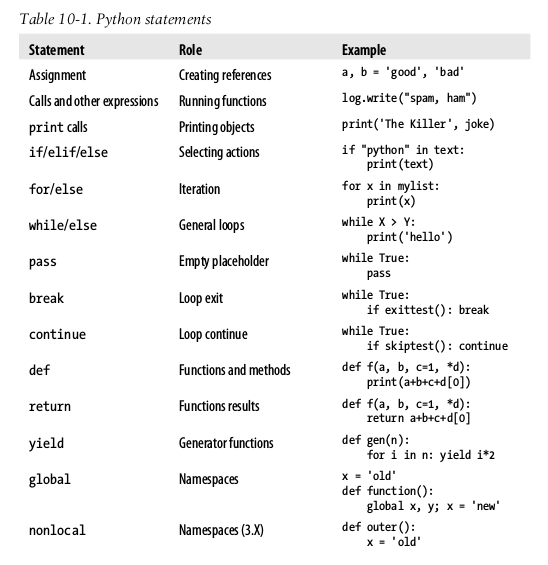
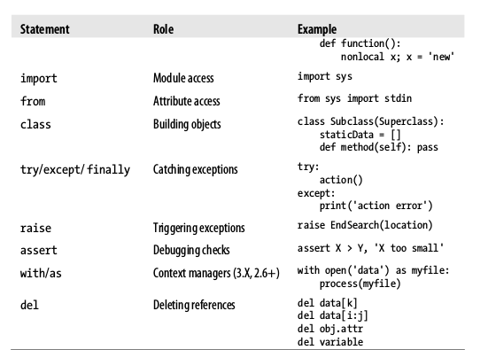

# LEGB Rule.

L, Local -- Names assigned in any way within a function (`def` or `lambda`)), and not declared global in that function.

E, Enclosing function locals -- Name in the local scope of any and all enclosing functions (`def` or `lambda`), from inner to outer.

G, Global (module) -- Names assigned at the top-level of a module file, or declared `global` in a `def` within the file.

B, Built-in (Python) -- Names preassigned in the built-in names module : `open`,`range`,`SyntaxError`,...

Although we can change variables in another file directly, we usually shouldn't.

```python
# first.py
X = 99 # This code doesn't know about second.py
# second.py
import first
print(first.X)
first.X = 88 # OK: references a name in another file
# But changing it can be too subtle and implicit
```

The problem with the assignment to `first.X`, however, is that it is far too implicit: whoever's charged with maintaining or reusing the `first` module probably has no clue that some arbitrarily far-removed module on the import chain can change `X` out from under him or her at runtime. In fact, the second module may be in a completely different directory, and so difficult to notice at all.

This sets up too strong a coupling between the two files--because they are both dependent on the value of the variable `X`, it's difficult to understand or reuse one file without the other. Such implicit cross-file dependencies can lead to inflexible code at best, and outright bugs at worst.

the best prescription is generally to not do this--the best way to communicate across file boundaries is to call functions, passing in arguments and getting back return values. In this specific case, we would probably be better off coding an accessor function to manage the change:

```python
# first.py
X = 99
def setX(new):
    global X
    X = new
# second.py
import first
first.setX(88)
# Accessor make external changes explit
# And can manage access in a single place
# Call the function instead of changing directly
```

## Python Object Types

The Python Conceptual Hierarchy:

1. Programs are composed of modules.
2. Modules contain statements.
3. Statements contain expressions.
4. Expressions create and process objects.

> Traditional introductions to programming often stress its three pillars of _sequence_ ("Do this, then that"), _selection_ ("Do this if that is true"), and _repetition_ ("Do this many times"). Python has tools in all three categories, along with some for _definition_--of functions and classes. These themes may help you organize your thinking early on, but they are a bit artificial and simplistic. Expressions such as comprehensions, for example, are both repetition and selection; some of these terms have other meanings in Python; and many later concepts won't seem to fit this mold at all. In Python, the more strongly unifying principle is objects, and what we can do with them.

**Why Tuples?**

So, why have a type that is like a list, but supports fewer operations? Frankly, tuples are not generally used as often as lists in practice, but their immutability is the whole point. If you pass a collection of objects around your program as a list, it can be changed anywhere; if you use a tuple, it cannot. That is, tuples provide a sort of integrity constraint that is convenient in large programs.

### Numeric accuracy in fractions and decimals

```python
0.1 + 0.1 + 0.1 - 0.3
#5.551115123125783e-17  # This should be zero (close, but not exact)
from fractions import Fraction
Fraction(1, 10) + Fraction(1, 10) + Fraction(1, 10) - Fraction(3, 10)
#Fraction(0, 1)
from decimal import Decimal
Decimal('0.1') + Decimal('0.1') + Decimal('0.1') - Decimal('0.3')
#Decimal('0.0')
```

### Numeric Extensions

If you need to do serious number crunching, an optional extension for Python called `NumPy` (Numeric Python) provides advanced numeric programming tools, such as a matrix data type, vector processing, and sophisticated computation libraries. Hardcore scientific programming groups at places like Los Alamos and NASA use Python with `NumPy` to implement the sorts of tasks they previously coded in C++, FORTRAN, or Matlab. The combination of Python and `NumPy` is often com- pared to a free, more flexible version of Matlab--you get `NumPy`'s performance, plus the Python language and its libraries

## Dynamic Typing

### Copy

```python
import copy
X = copy.copy(Y)  # Make top-level "shallow" copy of any object Y
X = copy.deepcopy(Y)  # Make deep copy of any object Y: copy all nested parts
```

### "Weak" References

You may occasionally see the term "weak reference" in the Python world. This is a somewhat advanced tool, but is related to the reference model we've explored here, and like the `is` operator, can't really be understood without it.

In short, a weak reference, implemented by the weakref standard library module, is a reference to an object that does not by itself prevent the referenced object from being garbage-collected. If the last remaining references to an object are weak references, the object is reclaimed and the weak references to it are automatically deleted (or otherwise notified). This can be useful in dictionary-based caches of large objects, for example; otherwise, the cache's reference alone would keep the object in memory indefinitely. Still, this is really just a special-case extension to the reference model. For more details, see Python's library manual.

## Lists and Dictionaries

**Dictionaries Versus Lists**

In practice, dictionaries tend to be best for data with labeled components, as well as structures that can benefit from quick, direct lookups by name, instead of slower linear searches. As we've seen, they also may be better for sparse collections and collections that grow at arbitrary positions.

Dictionary value views are never set-like, since their items are not necessarily unique or immutable:

```python
D = {'a': 1, 'b': 2, 'c': 3}
K = D.keys()
V = D.values()
D.items()
#dict_items([('b', 2), ('a', 1), ('c', 3)])
K, V
#dict_keys(['b', 'a', 'c']), dict_values([2, 1, 3])
K | {'x': 3}
#{'b', 'a', 'c', 'x'}
K | ['x']
#{'b', 'a', 'c', 'x'}
# Keys (and some items) views are set-like
V & {'x': 3}
#TypeError: unsupported operand type(s) for &: 'dict_values' and 'dict'
V & {'x': 3}.values()
#TypeError: unsupported operand type(s) for &: 'dict_values' and 'dict_values'


D = {'a': 1, 'b': 2, 'c': 3}
D.keys() & D.keys()  # Intersect keys views
#{'b', 'c', 'a'}
D.keys() & {'b'}  # Intersect keys and set
#{'b'}
D.keys() & {'b': 1}  # Intersect keys and dict
#{'b'}
D.keys() | {'b', 'c', 'd'}  # Union keys and set
{'b', 'c', 'a', 'd'}


# Items views are set-like too if they are hashable--that is, if they contain only immutable objects:

D.items() | K
#{('b', 2), 'b', 'c', ('c', 3), ('a', 1), 'a'}
D.items() | D
#{'b', 'c', ('c', 3), ('a', 1), 'a', ('b', 2)}
D.items() | {('c', 3), ('d', 4)}
#{('c', 3), ('d', 4), ('b', 2), ('a', 1)}

dict(D.items() | {('c', 3), ('d', 4)})  # dict accepts iterable sets too
#{'d': 4, 'b': 2, 'c': 3, 'a': 1}
```

Dictionary's keys must be _immutable_ objects

### Using dictionaries to simulate flexible lists: Integer keys

When you use lists, it is illegal to assign to an offset that is off the end of the list:

```python
L = []
L[99] = 'spam'
'''
Traceback (most recent call last):
  File "<pyshell#17>", line 1, in <module>
    L[99]
IndexError: list index out of range
'''
```

Although you can use repetition to preallocate as big a list as you'll need (e.g.,`[0]*100`), you can also do something that looks similar with dictionaries that does not require such space allocations. By using integer keys, dictionaries can emulate lists that seem to grow on offset assignment:

```python
D = {}
D[99] = 'spam'
D[99]
#'spam'
D
{99: 'spam'}
```

### Using dictionaries for sparse data structures: Tuple keys

Here, we can use a dictionary to represent a three-dimensional array that is empty except for the two positions `(2,3,4)` and `(7,8,9)`. The keys are tuples that record the coordinates of nonempty slots. Rather than allocating a large and mostly empty three- dimensional matrix to hold these values, we can use a simple two-item dictionary.

```python
Matrix = {(2, 3, 4): 88, (7, 8, 9): 99}
Matrix[(2,3,6)]
'''
Traceback (most recent call last):
  File "<pyshell#19>", line 1, in <module>
    Matrix[(2, 3, 6)]
KeyError: (2, 3, 6)
'''
a = Matrix.get((2, 3, 6), 0)
a
#0
```

### Ways to Make Dictionaries

```python
{'name': 'Bob', 'age': 40}              # Traditional literal expression

D = {}                                  # Assign by keys dynamically
D['name'] = 'Bob'
D['age'] = 40

dict(name='Bob', age=40)                # dict keyword argument form
dict([('name', 'Bob'), ('age', 40)])    # dict key/value tuples form

dict(zip(keylist, valueslist))          # Zipped key/value tuples form (ahead)

dict.fromkeys(['a', 'b'], 0)
#{'a': 0, 'b': 0}

D = {k: v for (k, v) in zip(['a', 'b', 'c'], [1, 2, 3])}
D
#{'b': 2, 'c': 3, 'a': 1}               # comprehensions
```

> In practice, dictionaries tend to be best for data with labeled components, as well as structures that can benefit from quick, direct lookups by name, instead of slower linear searches. As we've seen, they also may be better for sparse collections and collections that grow at arbitrary positions.

## Tuples

### Why Lists and Tuples

Why do we need tuples if we have lists?

Some of the reasoning may be historic; Python's creator is a mathematician by training, and he has been quoted as seeing a tuple as a simple association of objects and a list as a data structure that changes over time. In fact, this use of the word "tuple" derives from mathematics, as does its frequent use for a row in a relational database table.

The best answer, however, seems to be that the immutability of tuples provides some _integrity_--you can be sure a tuple won't be changed through another reference else- where in a program, but there's no such guarantee for lists. Tuples and other immutable objects, therefore, serve a similar role to "constant" declarations in other languages, though the notion of constantness is associated with objects in Python, not variables.

Tuples can also be used in places that lists cannot--for example, as dictionary keys

> rule of thumb, lists are the tool of choice for ordered collections that might need to change; tuples can handle the other cases of fixed associations.

### Tuples for Records: Named Tuples

We can represent record-like information with both a list and a dictionary. Dictionaries offer the advantage of more mnemonic keys that label data. As long as we don't require mutability, _tuples_ can serve similar roles, with positions for record fields like lists.

```python
bob = ('Bob', 40.5, ['dev', 'mgr'])     # Tuple record
bob
#('Bob', 40.5, ['dev', 'mgr'])
bob[0], bob[2]                          # Access by position
#('Bob', ['dev', 'mgr'])
```

we can implement objects that offer both positional and named access to record fields with `namedtuple` utility in the `collections` library.

```python
from collections import namedtuple
Rec = namedtuple('Rec', ['name', 'age', 'jobs'])
bob = Rec('Bob', age=40.5, jobs=['dev', 'mgr'])
bob
#Rec(name='Bob', age=40.5, jobs=['dev', 'mgr'])

bob[0], bob[2]
#('Bob', ['dev', 'mgr'])
bob.name, bob.jobs
#('Bob', ['dev', 'mgr'])

o = bob._asdict()
o['name'], o['jobs']
#('Bob', ['dev', 'mgr'])
o
#OrderedDict([('name', 'Bob'), ('age', 40.5), ('jobs', ['dev', 'mgr'])])
```

named tuples are a tuple/class/dictionary hybrid. They also represent a classic tradeoff. In exchange for their extra utility, they require extra code (the two startup lines in the preceding examples that import the type and make the class), and incur some performance costs to work this magic. (In short, named tuples build new classes that extend the tuple type, inserting a property accessor method for each named field that maps the name to its position

## Files

the built-in `open()` function creates a Python file object, which serves as a link to a file residing on your machine. After calling `open`, you can transfer strings of data to and from the associated external file by calling the returned file object's methods.

Files are considered a core type because they are created by a built-in function, but they're not numbers, sequences, or mappings, and they don't respond to expression operators; they export only methods for common file-processing tasks. Most file methods are concerned with performing input from and output to the external file associated with a file object, but other file methods allow us to seek to a new position in the file, flush output buffers, and so on.

Operation                             | Interpretation
------------------------------------- | -----------------------------------------------------
output = open(r'C:\spam', 'w')        | Create output file ( 'w' means write)
input = open('data', 'r')             | Create input file ( 'r' means read)
input = open('data')                  | Same as prior line ( 'r' is the default)
aString = input.read()                | Read entire file into a single string
aString = input.read(N)               | Read up to next N characters (or bytes) into a string
aString = input.readline()            | Read next line (including \n newline) into a string
aList = input.readlines()             | Read entire file into list of line strings (with \n )
output.write(aString)                 | Write a string of characters (or bytes) into file
output.writelines(aList)              | Write all line strings in a list into file
output.close()                        | Manual close (done for you when file is collected)
output.flush()                        | Flush output buffer to disk without closing
anyFile.seek(N)                       | Change file position to offset N for next operation
for line in open('data'): use line    | File iterators read line by line
open('f.txt', encoding='latin-1')     | Python 3.X Unicode text files ( str strings)
open('f.bin', 'rb')                   | Python 3.X bytes files ( bytes strings)
codecs.open('f.txt', encoding='utf8') | Python 2.X Unicode text files ( unicode strings)
open('f.bin', 'rb')                   | Python 2.X bytes files ( str strings)

- File iterators are best for reading lines
- Content is strings, not objects
- Files are buffered and seekable
- `close` is often optional: auto-close on collection

  - in Python an object's memory space is automatically reclaimed as soon as the object is no longer referenced anywhere in the program.
  - On the other hand, including manual close calls doesn't hurt, and may be a good habit to form, especially in long-running systems (Use `with`/`as`)

## Storing Files

Use `pickle` to store native Python objects

JSON is a newer and emerging data interchange format, which is both programming-language-neutral and supported by a variety of systems. MongoDB, for instance, stores data in a JSON document database (using a binary JSON format).

JSON does not support as broad a range of Python object types as pickle , but its portability is an advantage in some contexts, and it represents another way to serialize a specific category of Python objects for storage and transmission.

Use `struct` to deal with packed binary data, created perhaps by a C language program or a network connection.

There are additional file-like tools in the Python toolset. Among these:

- _Standard streams_: Preopened file objects in the `sys` module, such as `sys.stdout`
- _Descriptor files in the `os` module_: Integer file handles that support lower-level tools such as file locking
- _Sockets, pipes, and FIFOs_: File-like objects used to synchronize processes or communicate over networks
- _Access-by-key files known as "shelves"_: Used to store unaltered and pickled Python objects directly, by key
- _Shell command streams_: Tools such as `os.popen` and `subprocess.Popen` that support spawning shell commands and reading and writing to their standard streams

## Core Types Review

### Comparisons, Equality, and Truth

The `==` operator tests value equivalence. Python performs an equivalence test, comparing all nested objects recursively.

The `is` operator tests object identity. Python tests whether the two are really the same object (i.e., live at the same address in memory).

Numbers are compared by relative magnitude, after conversion to the common highest type if needed.

Strings are compared lexicographically (by the character set code point values returned by `ord`), and character by character until the end or first mismatch (`"abc" < "ac"`).

Lists and tuples are compared by comparing each component from left to right, and recursively for nested structures, until the end or first mismatch (`[2] > [1, 2]`).

Sets are equal if both contain the same items (formally, if each is a subset of the other), and set relative magnitude comparisons apply subset and superset tests.

Dictionaries compare as equal if their sorted `(key, value)` lists are equal. Relative magnitude comparisons are not supported for dictionaries in Python 3.X, but they work in 2.X as though comparing sorted (key, value) lists.

Nonnumeric mixed-type magnitude comparisons (e.g., 1 < 'spam' ) are errors in Python 3.X. They are allowed in Python 2.X, but use a fixed but arbitrary ordering rule based on type name string. By proxy, this also applies to sorts, which use comparisons internally: nonnumeric mixed-type collections cannot be sorted in 3.X.

Numbers are false if zero, and true otherwise. Other objects are false if empty, and true otherwise.

### Cyclic Data Structures

```python
L = ['grail']
L.append(L)
L
#['grail', [...]]
```

Don't use cyclic references unless you really need to, and make sure you anticipate them in programs that must care.

## Python Statements





## Naming conventions

Names that begin with a single underscore (`_X`) are not imported by a `from module import *` statement.

Names that have two leading and trailing underscores ( `__X__` ) are system-defined names that have special meaning to the interpreter.

Names that begin with two underscores and do not end with two more (`__X`) are localized ("mangled") to enclosing classes

The name that is just a single underscore (`_`) retains the result of the last expression when you are working interactively.
