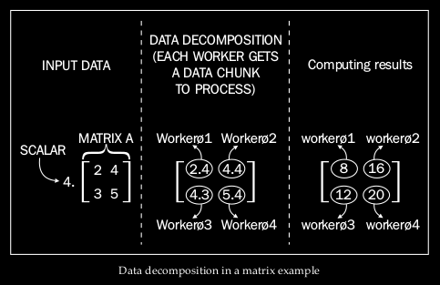
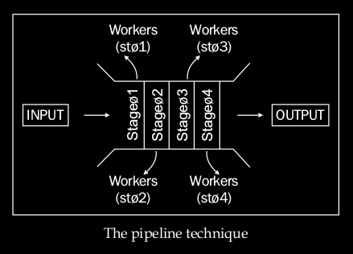

# Parallel Programming With Python by Jan Palach - Chap 2: Designing Parallel Algorithms

<!-- toc orderedList:0 -->

 - [Parallel Programming With Python by Jan Palach - Chap 2: Designing Parallel Algorithms](#parallel-programming-with-python-by-jan-palach-chap-2-designing-parallel-algorithms)

  - [The divide and conquer technique](#the-divide-and-conquer-technique)
  - [Using data decomposition](#using-data-decomposition)
  - [Decomposing tasks with pipeline](#decomposing-tasks-with-pipeline)
  - [Processing and mapping](#processing-and-mapping)

    - [Identifying independent tasks](#identifying-independent-tasks)
    - [Identifying the tasks that require data exchange](#identifying-the-tasks-that-require-data-exchange)
    - [Load Balance](#load-balance)

<!-- tocstop -->

 ## The divide and conquer technique

> decompose the problem in order to identify parts of it that may be handled independently.

## Using data decomposition

- in real world, there is an asymmetry of the relation between the number of workers and the quantity of data that is decomposed, and this directly affects the performance of the solution.
- the results generated by each worker must be correlated -- the end of the program's output must make sense.
- So, workers must establish communication among them by means of using a message exchanging pattern or even a shared state standard

> The granularity choice of data decomposition might affect the performance of a solution.

## Decomposing tasks with pipeline

- Pipeline breaks large tasks into smaller independent tasks that run in a parallel manner.
- compared to an assembly line at a vehicle factory

A system processes images in batches and persists data that is extracted into a database. We will have the following sequence of facts:

- Input images are received and lined in parallel to be processed at the second stage
- Images are parsed and useful information is sent to the third stage
- Filters are applied onto images in parallel during the third stage
- Data that results from the third stage is persisted in the database

## Processing and mapping

- After decomposing data or tasks, ask: "How do we divide the processing load among workers to obtain good performance?"
- two important steps when defining process mapping:

  - Identifying independent tasks
  - Identifying tasks that require data exchange ata exchange

### Identifying independent tasks

- allow us to distribute the tasks among different workers,
- as these tasks do not need constant communication.
- can be executed in different workers without impacting other task executions.

### Identifying the tasks that require data exchange

Grouping the tasks that establish constant communication in a single worker can enhance the performance.

- True when there is a large load of data communication.
- Help reduce the overhead in exchange of the information within the tasks.

### Load Balance

- The more we distribute tasks to different workers, the more we increase the granularity of the communication.
- the more tasks we group in a single worker, the more we reduce the overhead associated with communication.
