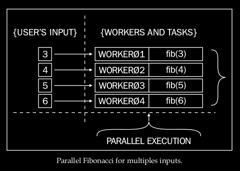
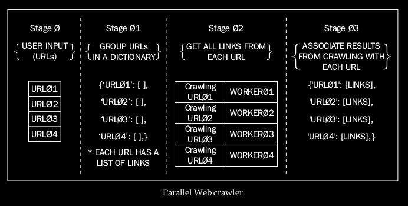

# Parallel Programming With Python by Jan Palach - Chap 3: Identifying Parallelizable Problems

<!-- toc orderedList:0 -->

- [Parallel Programming With Python by Jan Palach - Chap 3: Identifying Parallelizable Problems](#parallel-programming-with-python-by-jan-palach-chap-3-identifying-parallelizable-problems)
	- [Obtaining the highest Fibonacci value for multiple inputs](#obtaining-the-highest-fibonacci-value-for-multiple-inputs)
	- [Crawling the Web](#crawling-the-web)

<!-- tocstop -->

 ## Obtaining the highest Fibonacci value for multiple inputs

> The Fibonacci function calculates the highest Fibonacci value for a specific piece of input data ... Suppose the user provides an array of values as input, so making these calculations sequentially would be interesting. But, what if 1 million users are connected at the same time to make requests? In this case, some users would have to wait for quite a long time until they are answered.

## Crawling the Web

> A Web crawler consists of a computer program that browses the Web to search for information on pages. The scenario to be analyzed is a problem in which a sequential Web crawler is fed by a variable number of Uniform Resource Locators (URLs), and it has to search all the links within each URL provided. Imagining that the number of input URLs may be relatively large, we could plan a solution looking for parallelism in the following way:

> 1. Group all the input URLs in a data structure.
> 2. Associate data URLs with tasks that will execute the crawling by obtaining information from each URL.
> 3. Dispatch the tasks for execution in parallel workers.
> 4. The result from the previous stage must be passed to the next stage, which will improve raw collected data, thereby saving them and relating them to the original URLs.

